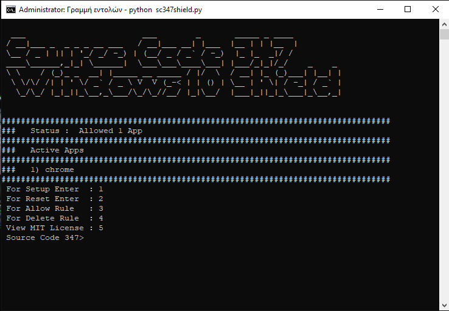

# SourceCode347Windows10Shield
Windows 10 Shield

# Requirements

Download and install <a href="https://python.org">Python</a>

Don't Forget to check "Add Python to Path" On installation

# Usage if file is in Desktop

    1) open terminal as administrator and type
    
    2) cd c:/Users/YourName/Desktop
    
    3) python sc347shield.py

# Add Rule

    4) type 3 and press enter

    5) type chrome and press enter

    6) type the full path of chrome C:\Program Files\Google\Chrome\Application\chrome.exe and press enter

# Delete Rule

    7) type 4 and press enter

    8) type the name of Active App and press enter

* The Reset option resets all firewall settings

* The Setup option resets all firewal settings and block any connection and app

    
# License
MIT License

Copyright (c) 2021 SourceCode347(Nikolaos Bazigos)

Permission is hereby granted, free of charge, to any person obtaining a copy
of this software and associated documentation files (the "Software"), to deal
in the Software without restriction, including without limitation the rights
to use, copy, modify, merge, publish, distribute, sublicense, and/or sell
copies of the Software, and to permit persons to whom the Software is
furnished to do so, subject to the following conditions:

The above copyright notice and this permission notice shall be included in all
copies or substantial portions of the Software.

THE SOFTWARE IS PROVIDED "AS IS", WITHOUT WARRANTY OF ANY KIND, EXPRESS OR
IMPLIED, INCLUDING BUT NOT LIMITED TO THE WARRANTIES OF MERCHANTABILITY,
FITNESS FOR A PARTICULAR PURPOSE AND NONINFRINGEMENT. IN NO EVENT SHALL THE
AUTHORS OR COPYRIGHT HOLDERS BE LIABLE FOR ANY CLAIM, DAMAGES OR OTHER
LIABILITY, WHETHER IN AN ACTION OF CONTRACT, TORT OR OTHERWISE, ARISING FROM,
OUT OF OR IN CONNECTION WITH THE SOFTWARE OR THE USE OR OTHER DEALINGS IN THE
SOFTWARE.
